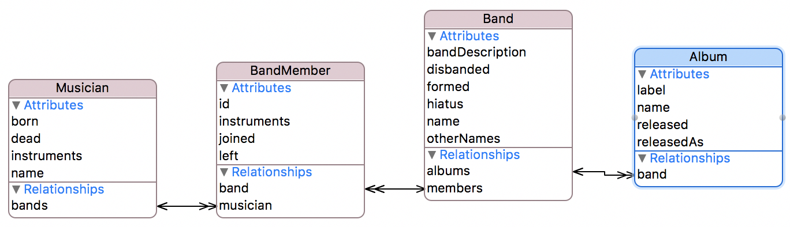
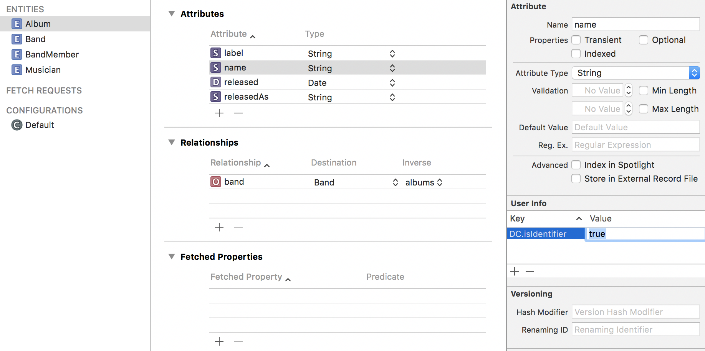

# JSONCache

[](https://travis-ci.org/andersblehr/JSONCache)
[](https://github.com/Carthage/Carthage)
[](https://cocoapods.org/)
[](http://cocoadocs.org/docsets/JSONCache)

JSONCache is a thin layer on top of Core Data that seamlessly
consumes, caches and produces JSON data.

- Automatically creates Core Data objects from JSON data, or merges
  JSON data into objects that already exist.
- Automatically maps 1:1 and 1:N relationships based on inferred
  knowledge of your Core Data model.
- If necessary, automatically maps between `snake_case` in JSON and
  `camelCase` in Core Data attribute names.
- Generates JSON on demand, both from `NSManagedObject` instances, and
  from any `struct` that adopts the `JSONifiable` protocol.
- Operates on background threads to avoid interfering with your app's
  responsiveness.
- Both synchronous and asynchronous methods return instances of
  [Result](https://github.com/antitypical/Result), the go-to
  implementation for Swift of a functional pattern that puts emphasis
  on the semantics of success or failure.

## Content

- [Show, don't tell](#show-dont-tell)
  - [Consuming JSON](#consuming-json)
  - [Producing JSON](#producing-json)
- [But do tell](#but-do-tell)
  - [Case conversion](#case-conversion)
  - [Date conversion](#date-conversion)
  - [Relationship mapping](#relationship-mapping)
    - [How to ...](#how-to)
    - [But how ...?](#but-how)
- [Installation](#installation)
  - [CocoaPods](#cocoapods)
  - [Carthage](#carthage)
  - [Compatibility](#compatibility)
- [License](#license)

## Show, don't tell

### Consuming JSON

Say your backend produces JSON like this:

```json
{
  "bands": [
    {
      "name": "Japan",
      "formed": 1974,
      "disbanded": 1991,
      "hiatus": "1982-1989",
      "description": "Initially a glam-inspired group [...]"
    },
    ...
  ],
  "band_members": [
    {
      "id": "David Sylvian in Japan",
      "musician": "David Sylvian",
      "band": "Japan",
      "instruments": "Lead vocals, keyboards, guitar",
      "joined": 1974,
      "left": 1991
    },
    ...
  ],
  "musicians": [
    {
      "name": "David Sylvian",
      "born": 1958,
      "instruments": "Vocals, guitar, keyboards"
    },
    ...
  ],
  "albums": [
    {
      "name": "Gentlemen Take Polaroids",
      "band": "Japan",
      "released": "1980-10-24T00:00:00Z",
      "label": "Virgin"
    },
    ...
  ]
}
```

To cache this data in your app, you create a suitable Core Data model:



And with only a few lines of code, the JSON data is safely persisted
in Core Data on your device, relationships and all:

```swift
import JSONCache

...

let jsonObject = try! JSONSerialization.jsonObject(with: jsonData) as! [String: Any]
let bands = jsonObject["bands"] as! [[String: Any]]
let bandMembers = jsonObject["band_members"] as! [[String: Any]]
let musicians = jsonObject["musicians"] as! [[String: Any]]
let albums = jsonObject["albums"] as! [[String: Any]]
        
JSONCache.casing = .snake_case
JSONCache.dateFormat = .iso8601WithSeparators
        
JSONCache.bootstrap(withModelName: "Bands") { result in
  switch result {
  case .success:
    JSONCache.stageChanges(withDictionaries: bands, forEntityWithName: "Band")
    JSONCache.stageChanges(withDictionaries: bandMembers, forEntityWithName: "BandMember")
    JSONCache.stageChanges(withDictionaries: musicians, forEntityWithName: "Musician")
    JSONCache.stageChanges(withDictionaries: albums, forEntityWithName: "Album")
    JSONCache.applyChanges { result in
      switch result {
      case .success:
        print("Data all nicely tucked in")
      case .failure(let error):
        print("An error occurred: \(error)")
      }
    }
  case .failure(let error):
    print("An error occurred: \(error)")
  }
}
```

If you receive additional data at a later stage it's even simpler:

```swift
let albums = jsonObject["albums"] as! [[String: Any]]

JSONCache.stageChanges(withDictionaries: albums, forEntityWithName: "Album")
JSONCache.applyChanges { result in
  switch result {
  case .success:
    print("Data all nicely tucked in")
  case .failure(let error):
    print("An error occurred: \(error)")
  }
}
```

### Producing JSON

If your app allows producing as well as consuming data, you can
generate JSON directly from `NSManagedObject` instances:

```swift
switch JSONCache.fetchObject(ofType: "Band", withId: "Japan") {
  case .success(let japan):
    var japan = japan as! Band
    japan.otherNames = "Rain Tree Crow"
    
    ServerProxy.update(band: japan.toJSONDictionary()) { result in
      switch result {
      case .success:
        switch JSONCache.save() { result in
          case .success:
            print("Japan as Rain Tree Crow all nicely tucked in")
          case .failure(let error):
            print("An error occurred: \(error)")
        }
      case .failure(let error):
        print("An error occurred: \(error)")
      }
    }
  case .failure(let error):
    print("An error occurred: \(error)")
}
```

To create and persist new objects to the backend, you can either
create the `NSManagedObject` instance first and then use it to
generate JSON for the backend, or if you prefer to wait until the
record is safely persisted on the backend, you can generate JSON from
any `struct` that adopts the `JSONifiable` protocol:

```swift
struct BandInfo: JSONifiable {
  var name: String
  var bandDescription: String
  var formed: Int
  var disbanded: Int?
  var hiatus: Int?
  var otherNames: String?
}

let u2Info = BandInfo(name: "U2", bandDescription: "Dublin boys", formed: 1976, disbanded: nil, hiatus: nil, otherNames: "Passengers")

ServerProxy.save(band: u2Info.toJSONDictionary()) { result in
  switch result {
  case .success:
    u2 = NSEntityDescription.insertNewObject(forEntityName: "Band" into: JSONCache.mainContext)!
    u2.setAttributes(fromDictionary: u2Info)
    
    switch JSONCache.save() { result in
    case .success:
      print("U2 all nicely tucked in")
    case .failure(let error)
      print("An error occurred: \(error)")
    }
  case .failure(let error):
    print("An error occurred: \(error)")
}
```

## But do tell

### Case conversion

Before JSON data is loaded into Core Data, any necessary case
conversion is performed on the attribute names. The
`JSONCache.casing` configuration parameter tells JSONCache whether
to expect `.snake_case` or `.camelCase` in the JSON data. Case
conversion is only done if the JSON casing is `.snake_case`:

- `attribute_name` becomes `attributeName`.
- `description`, being a reserved attribute name, becomes
  `entityNameDescription`.
  
Similarly, when producing JSON:

- `attributeName` becomes `attribute_name`.
- `entityNameDescription` becomes `description`.

### Date conversion

JSONCache supports the following JSON date formats:

- ISO 8601 with separators: `2000-08-22T12:28:00Z`
- ISO 8601 without separators: `20000822T122800Z`
- Seconds since 00:00 on 1 Jan 1970 as a double precision value:
  `966947280.0`

Use the `JSONCache.dateFormat` configuration parameter to tell
JSONCache which format to expect and/or produce.

### Relationship mapping

#### How to ...

In order for JSONCache to automatically map a 1:1 or a 1:N
relationship, you essentially only need to tell it one thing: The
primary key of the object on the '1: end' of the relationship. You do
this in either of two ways:

1. Use the name `id` for the primary key. (See Figure 1.)
2. Create a User Info key named `JC.isIdentifier` for the primary key
   attribute and assign it the value `true` or `YES` (or `TRUE` or
   `yes`; both are case insensitive). (See Figure 2.)
   


_Figure 1: Marking an entity's primary key by naming it `id`._



_Figure 2: Marking an entity's primary key by creating a User Info key
named `JC.isIdentifier` and setting it to `true`._

The primary key must be unique within an entity, but not across
entities.

#### But how ...?
   
When JSONCache instantiates or updates an `NSManagedObject` instance
from a JSON dictionary, it does so by inspecting the
`NSAttributeDescription`s of the `NSEntityDescription` that describes
the underlying entity, and assigns each attribute the corresponding
value from the JSON dictionary.

In a second pass, JSONCache inspects the `NSRelationshipDescription`s
of the entity, and for each relationship that is _not_ `toMany`, it
looks up the `NSEntityDescription` of the destination object. Through
a JSONCache extension method on `NSEntityDescription`, it obtains the
primary key of the destination entity. It already knows the primary
key _value_ of the destination object from the JSON dictionary, so now
it has all the information it needs in order to look it up, either in
the set of new objects created from the JSON data, or in Core Data if
it already has been persisted. Once it has a reference to the
destination object, it hooks up the relationship and moves on to the
next item.

Consider the following JSON records:

**Band**
```json
{
  "name": "Japan",
  "formed": 1974,
  "disbanded": 1991,
  "hiatus": "1982-1989",
  "description": "Initially a glam-inspired group [...]",
  "other_names": "Rain Tree Crow"
}
```

**Album**
```json
{
  "name": "Tin Drum",
  "band": "Japan",
  "released": "1981-11-13T00:00:00Z",
  "label": "Virgin"
}
```

JSONCache first creates two `NSManagedObject` instances, one for the
band Japan, and one for the _Tin Drum_ album, each holding all the
attributes from the corresponding JSON record. Then, in the second
pass, JSONCache looks at relationships. The `Band` entity participates
in 2 relationships, `albums` and `members` (see the ER diagram above),
both of which are `toMany`, so it does nothing. The `Album` entity
participates in 1 relationship, `band`, which is _not_
`toMany`. Through the `NSRelationshipDescription` describing the
`band` relationship, JSONCache finds that the destination entity is of
type `Band`, and through the `NSEntityDescription` describing the
destination entity, it finds that it has the primary key `name`. Now
JSONCache has all the information it needs. It looks up a `Band`
object whose `name` value is the same as the `band` value in the
`Album` dictionary for the _Tin Drum_ album (i.e., 'Japan'), and
finally hooks up the relationship.

## Installation

You can install JSONCache using either
[CocoaPods](http://cocoapods.org/) or
[Carthage](https://github.com/Carthage/Carthage).

### CocoaPods

```
pod 'JSONCache'
```

### Carthage

```
github "andersblehr/JSONCache" ~> 1.0
```

### Compatibility

- Swift 3.x
- macOS 10.11 or later
- iOS 9.3 or later
- watchOS 3.0 or later
- tvOS 9.2 or later

## License

JSONCache is released under the MIT license. See the
[LICENSE](LICENSE) file for details.
